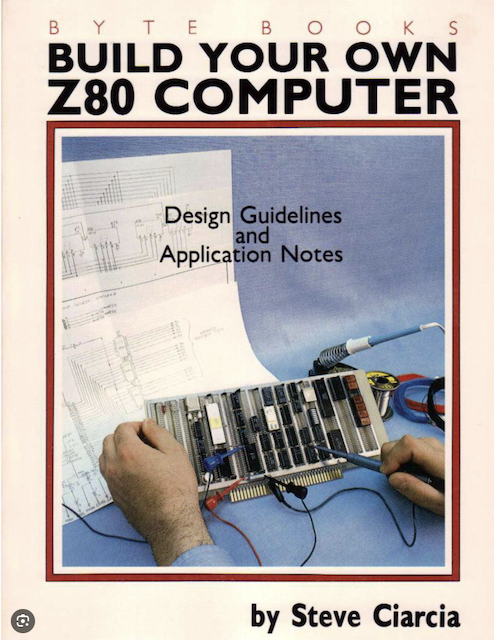
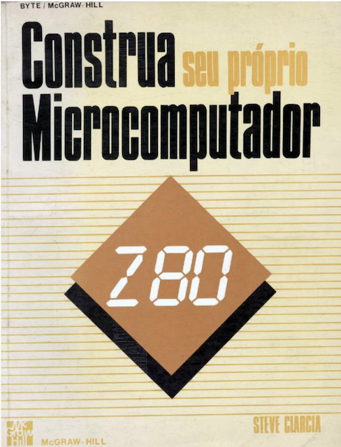
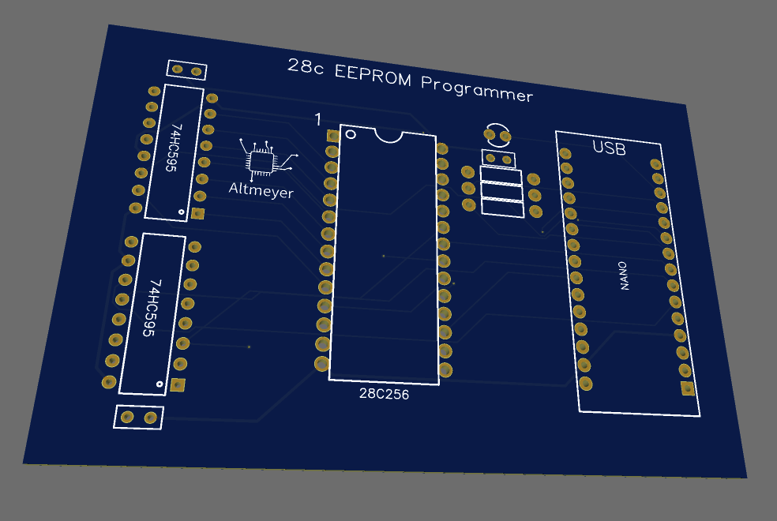
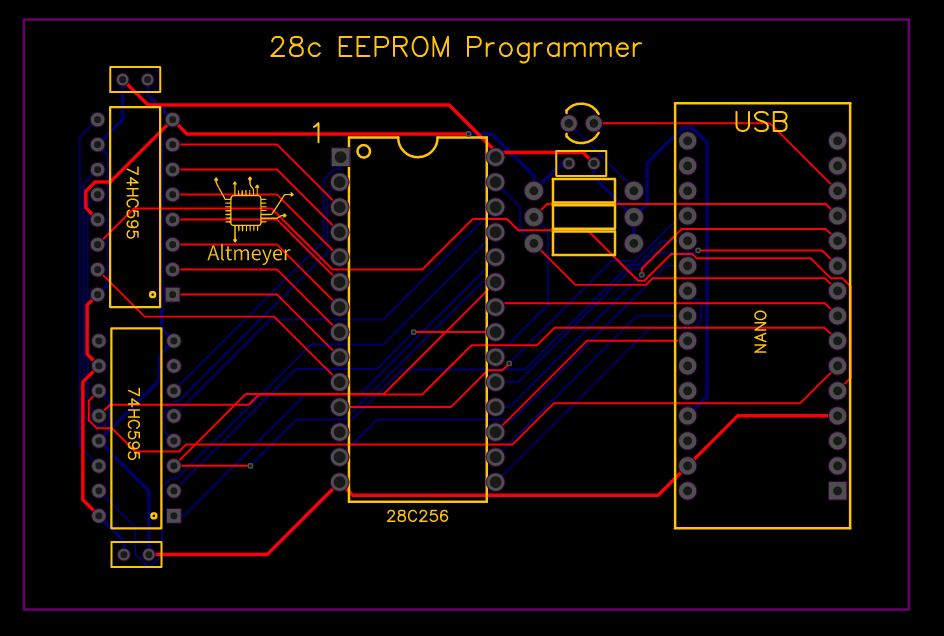
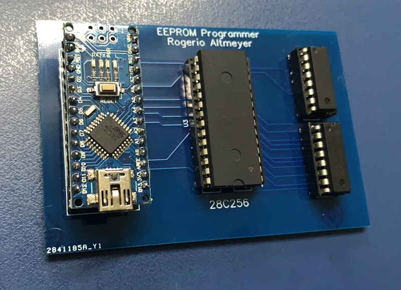

# 28c_Programmer

2020 - 2026 - Rogerio Altmeyer

[Versão em Português](https://github.com/raltmeyer/28c_programmer/blob/master/README_ptbr.md)

## Table of contents
* [Inside the project](#inside-the-project)
* [Circuit board](#circuit-board)
* [Board firmware](#board-firmware)
* [Command line client](#command-line-client)
* [Board Details](#board-details)

## Introduction

This EEPROM programmer was created to support the development of another retro-computing project I'm working on, which focuses on recreating computers from the 80s from scratch using a modular construction and MAYBE compatible with original binaries.

You will see similarities between this project and Ben Eater's 8-bit computer project, I took some inspiration from his work, however, this project is talking a different direction. 

My main goal is to create a project based on my childhood dream, where I used to read books like "Build your own Z80 computer" by Steve Ciarcia:

&nbsp;&nbsp;&nbsp;&nbsp;

At that time, I was 9-12 years old. My uncle Nicolau was a very active ham radio operator and had a lot of books about electronics. I used to spend hours reading them, and dreaming of building my own computer. He was and still is a great inspiration for me, and he gave me my first soldering iron and my passion for eletronics and technology.

<!--


Fun fact, back then, my entire family called me and my uncle "Professor Pardal and Lampadinha" (Professor Pardal and Lightbulb) - the two characters from the Brazilian version of Donald Duck comics, known for their inventions and gadgets.
-->

This series of projects is a way to make that childhood dream come true and at the same time, share the journey with the retro-computing community.

## General info

The programmer was designed specifically for the Atmel 32KB EEPROM AT28C256. Currently, the firmware is only compatible with this chip, but it can be easily adapted for other parallel memories.

## Inside the project

The project is divided into three parts:
- Schematic and circuit board design (Hardware)
- Board firmware (C++)
- Command line client running on the host machine, responsible for communicating with the board (Python)


## Circuit board

The board uses an Arduino Nano as its main component, which is responsible for communicating with the host computer and programming the memory chip.

The control bus and the data bus are connected directly to the Nano, while the 15 addressing lines of the chip are driven through two cascaded 8-bit shift registers.

Schematic for Board V1.3


The board design is available in a [ZIP file containing the Gerber files](https://github.com/raltmeyer/28c_programmer/blob/master/28c_programmer_board/Gerber_eeprom28_programmer.zip). 
I used the board printing services from [JLCPCB.com](https://jlcpcb.com) and highly recommend them.

## Board firmware

The board's firmware was developed in C++ using the Eclipse IDE. Its main feature is a message interpreter that processes commands from the host computer. This interpreter makes it easy to organize the code and add new features to the firmware.

### Firmware Core
- [28c_programmer.h](https://github.com/raltmeyer/28c_programmer/blob/master/28c_programmer_firmware/28c_programmer.h) Main header
- [pin_defs.h](https://github.com/raltmeyer/28c_programmer/blob/master/28c_programmer_firmware/pin_defs.h) Header with pin definitions
- [main.cpp](https://github.com/raltmeyer/28c_programmer/blob/master/28c_programmer_firmware/main.cpp) Main source file containing the setup() and loop() functions
- [interface.cpp](https://github.com/raltmeyer/28c_programmer/blob/master/28c_programmer_firmware/interface.cpp) Contains all functions for interfacing the Arduino with the EEPROM
- [util.cpp](https://github.com/raltmeyer/28c_programmer/blob/master/28c_programmer_firmware/util.cpp) Miscellaneous helper code
- [cmd_processor.cpp](https://github.com/raltmeyer/28c_programmer/blob/master/28c_programmer_firmware/cmd_processor.cpp) Implements the message interpreter

### Commands for use by the host
- [cmd_clear_block.cpp](https://github.com/raltmeyer/28c_programmer/blob/master/28c_programmer_firmware/cmd_clear_block.cpp) Clears the EEPROM
- [cmd_get_version.cpp](https://github.com/raltmeyer/28c_programmer/blob/master/28c_programmer_firmware/cmd_get_version.cpp) Returns the board's firmware version
- [cmd_read_block.cpp](https://github.com/raltmeyer/28c_programmer/blob/master/28c_programmer_firmware/cmd_read_block.cpp) Reads a 16-byte block and returns it to the host
- [cmd_read_byte.cpp](https://github.com/raltmeyer/28c_programmer/blob/master/28c_programmer_firmware/cmd_read_byte.cpp) Reads a single byte
- [cmd_write_block.cpp](https://github.com/raltmeyer/28c_programmer/blob/master/28c_programmer_firmware/cmd_write_block.cpp) Writes 1 to 16 bytes to the EEPROM

## Command line client

Written in Python 3, this tool is responsible for reading and writing files on the host machine, as well as sending and receiving data to and from the board's firmware.

### Dependency installs (macOS / Linux)

To run the client, you must have `python3` and install the following dependencies:
```
pip3 install argparse
pip3 install pyserial
```

You will also need to adjust the permissions:
```
chmod +x programmer.py
```

### Supported parameters
The client will show the following help indicating the supported parameters:
```
#./programmer.py
usage: programmer.py [-h] [--file FILE] [--address ADDRESS_BEGIN]
                     [--address-end ADDRESS_END]
                     serial {write,read,clear}
programmer.py: error: the following arguments are required: serial, mode
```

Required parameters:
- Serial port
- Operation mode
	- **write**
	- **read**
	- **clear**

Optional parameters:
- **--address**: The start address for the operation
- **--address-end**: The final address for the operation
- **--file**: The file to be read or written (required for **write** and **read** modes)


### Usage examples

Write `boot.hex` starting at address 0x0000:
```
./programmer.py /dev/serial_port write --file boot.hex 
```

Write `data.hex` starting at address 0x1E00:
```
./programmer.py /dev/serial_port write --file dado.hex --address 0x1e00
```

Read the entire EEPROM and save it to `dump.bin`:
```
./programmer.py /dev/serial_port read --file dump.bin 
```

Read from address 0x1E00 to 0x2A00 and save it to `dump.bin`:
```
./programmer.py /dev/serial_port read --file dump.bin --address 0x1e00 --address-end 0x2a00
```

Clear the entire EEPROM (writes 0xFF to all memory locations):
```
./programmer.py /dev/serial_port clear
```

Clear a specific EEPROM block:
```
./programmer.py /dev/serial_port clear --address 0x1e00 --address-end 0x2a00
```


## Board Details

Board version 1.3 - 3D view


Board version 1.3


Board version 1.1 assembled


